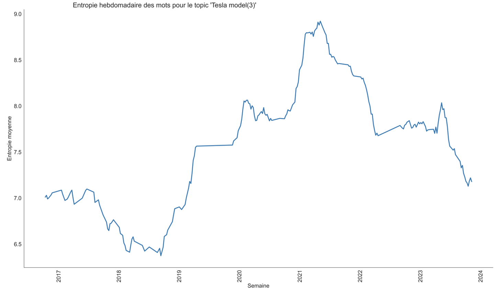

## Exemple de visualisation 

Voici quelques exemples de visualisation qu'il est possible de réaliser avec le notebook Analyse 

## Analyse de sentiment Tesa/Zoe

#### Analyse de sentiment Tesla

#### Analyse de sentiment Zoe

## Dispersion des scores de sentiment pour la Tesla Model 3

## Entropie_Tesla

