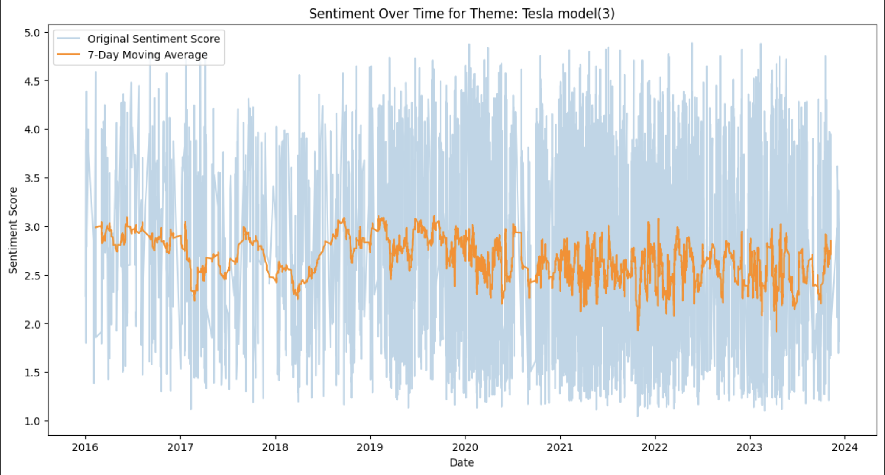
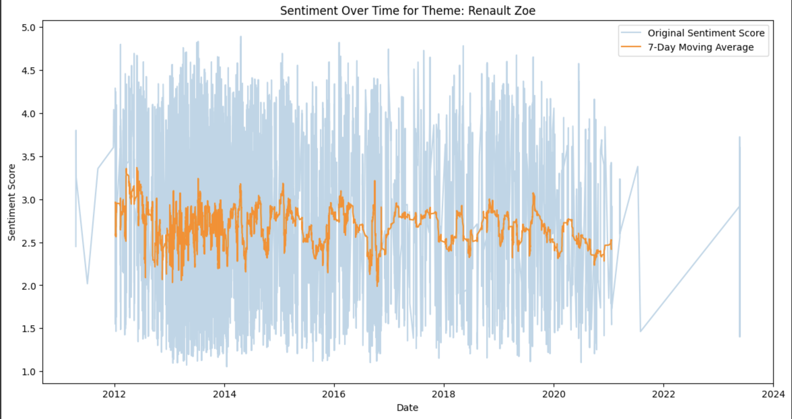
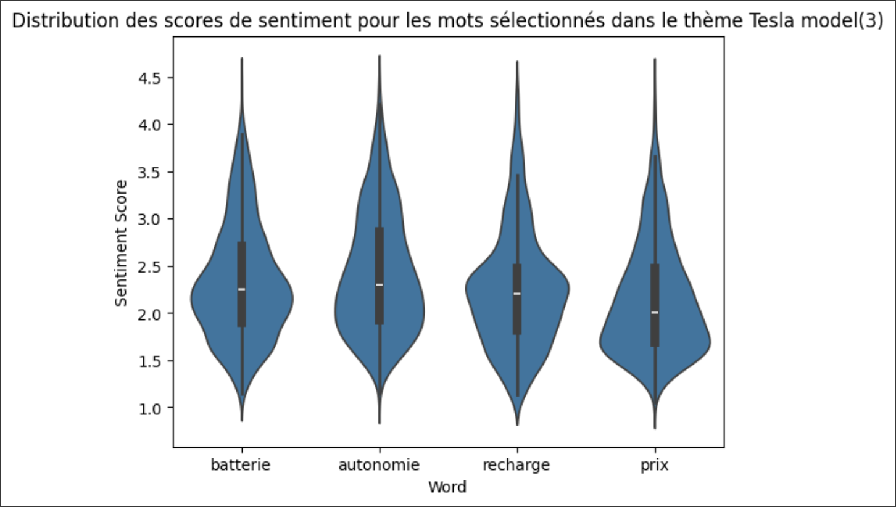
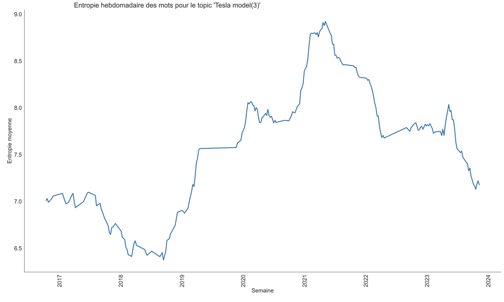

# Electric_car

## Description
Ce projet est en partie tiré du travail effectué lors de mon mémoire universitaire. Il porte sur l'analyse de discours d'utilisateurs de forum sur les véhicules électriques à travers diverses techniques telles que le NLP (traitement du langage naturel), l'analyse de sentiment, et l'entropie.

Les deux scripts sont des notebooks qui furent développés nativement sur Google Colab.

## Contenu
- **Scrapper_Forum**: Un script pour scrapper des données d'un forum suivant une même strucutre. Ce scrapper utilise Selenium pour automatiser la collecte et BeauttifulSoup pour cibler et collecter les données voulues 
                    
- **Analyse**: Analyse de sentiment et entropie des posts de forum. Le notebook est découpé en différente section ppur chacune des analyses

## Prérequis
- Python 3.x
- Google Colab (optionnel mais recommandé pour une exécution aisée des notebooks)
- Bibliothèques Python suivantes :
  - pandas
  - numpy
  - sklearn
  - nltk
  - matplotlib
  - seaborn
  - spacy
  - transformers
  - torch
  - tensorflow
  - sentencepiece
  - scipy
  - Selenium
  - Bs4

## Exemple de visualisation 

Voici quelques exemples de visualisation qu'il est possible de réaliser avec le notebook Analyse 

## Analyse de sentiment Tesa/Zoe

#### Analyse de sentiment Tesla

#### Analyse de sentiment Zoe

## Dispersion des scores de sentiment pour la Tesla Model 3

## Entropie_Tesla

Ce projet est sous licence MIT. Voir le fichier LICENSE pour plus de détails.
